# Shop-CMS

<a name="Description"></a>

## Description

This application is a personal project I designed to help a store owner manage their store. This content management system is created using React and Node.js with TailwindCSS for styling. I also utilized chartjs in react-chartjs-2 to get the responsive graphs. This project has been a test of will and knowledge for me. Getting it to where it is now was no easy task but ultimately I have come out a much better programmer.

**Table Of Contents**

- [Intro](#description)
- [Project Setup](#project-setup)
- [Folder Structure](#folder-structure)
- [Database Architecture](#database-architecture)
- [API Payload](#api-payload)
- [Usage - Home Page](#usage---home-page)
- [Usage - Inventory](#usage---inventory)
- [Usage - Sold](#usage---sold)
- [Usage - Users](#usage---users)
- [Usage - Statistics](#usage---statistics)
- [Usage - Mobile](#usage---mobile)
- [Testing](#testing)
- [Contributions](#contributions)

If you would like to view some of my journey in the development of this application, check out my blog I created [here](https://daedadev-blog.vercel.app/). Lets dive into the application.

<a name="Project Setup"></a>

## Project Setup

This application uses Javascript so you'll need node.js to run this application and download its dependencies. If you don't have node installed you can get that [here](https://nodejs.org/en/).

Once you have my project on your own machine you'll want to run

`npm install && cd client && npm install && cd ..`

This set of commands will install the server side dependencies as well as the client side dependencies and ensure that you end up at the root folder by the end of it. This may take a bit.

Next you'll need to setup the database. I am using MySQL workbench to handle my SQL database. All of the configuration for the database can be found in the `config` folder located in the `api` folder. The three parameters you'll need to setup either in the `.env` file or directly in `connection.js` are the **DB_NAME**, **DB_USER**, and **DB_PASSWORD**. You can set these up in the environment file.

An example being `DB_NAME=shopfrontDB` this would correspond with `process.env.DB_NAME` in the connection.js file.

Now to start the project you can simply type into the command line `npm run dev` and you'll have the development version of the application running on `localhost:3000`. Congratulations.

Now lets dive into the bones of the application.

<a name="Folder Structure"></a>

## Folder Structure

**API Layout**

```
/API
    /config
        /connection.js
    /controllers
        /categoryController.js
        /clothingController.js
        /orderController.js
        /userController.js
    /models
        /Category.js
        /ClothingItem.js
        /ClothingStock.js
        /Color.js
        /index.js
        /Order.js
        /Shipping.js
        /User.js
    /routes
        /category.js
        /clothing.js
        /index.js
        /orders.js
        /users.js
    /seeds
        /categoryData.js
        /clothingData.js
        /colorData.js
        /index.js
        /orderData.js
        /seedData.js
        /shippingData.js
        /stockData.js
        /userData.js
    /validate
        /userValidate.js
```

All of this coupled with the **server.js** file at the root directory of the project make up the backend of my project. I tried to follow a sort of MVC format when laying out this application. Separate backend API folder and frontend Client folder.

**Client Side Layout**

```
/client
    /node_modules
    /public
        /favicon.ico
        /index.html
    /src
        /components
            /CreateModal
                /CreateModal.js
            /EditModal
                /EditModal.js
            /InventoryItem
                /InventoryItem.js
            /LoadingDefault
                /LoadingDefault.js
            /LoadingIcon
                /LoadingIcon.js
            /OrderItem
                /OrderItem.js
            /OrderModal
                /OrderModal.js
            /popupModals
                /confirmModal.js
            /SideBar
                /MobileSideBar.js
                /SideBar.js
            /UserItem
                /UserItem.js
            /VariantComponents
                /AddVariant.js
                /CurrentVariant.js
        /pages
            /InventoryPage.js
            /MainPage.js
            /SoldPage.js
            /StatsPage.js
            /UserPage.js
        /utils
            /helpers
                /__test__
                    /categoryStats.test.js
                    /ordersMain.test.js
                    /productStats.test.js
                    /shippingStats.test.js
                /categoryStats.herlpers.js
                /fetchFunction.helpers.js
                /ordersMain.helpers.js
                /productStats.helpers.js
                /shippingStats.helpers.js
        /App.js
        /index.css
        /index.js
        /reportWebVitals.js
        /setupTests.js
    /.gitignore
    /package-lock.json
    /package.json
    /postcss.config.js
    /README.md
    /tailwind.config.js
```

Now that I've shown off the bones of the project, let me show you a bit of the brains behind it all.

<a name="Database Architecture"></a>

## Database Architecture

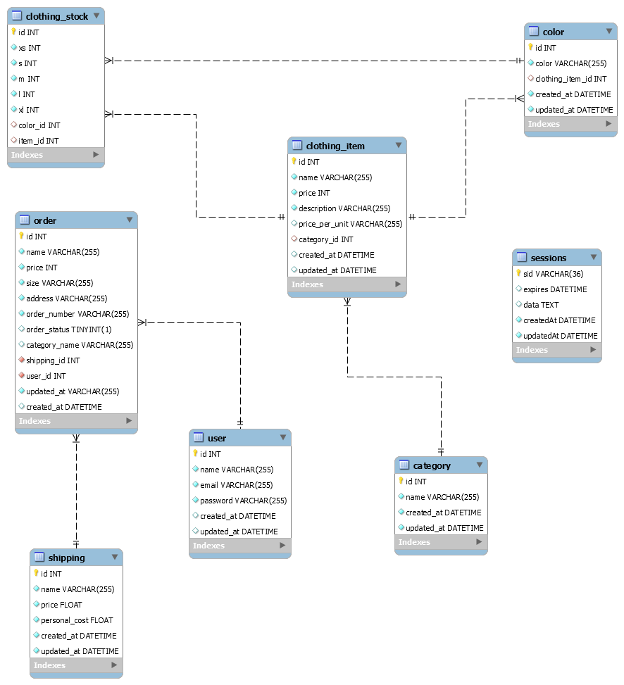

This design had been a bit tricky throughout its implementation however it should be fairly self explanatory. `Category` has many `clothing_item` which contains `color` and by extension `clothing_stock`. Color in this case refers to any sort of variant you can have on your clothing item.

`Order` belongs to `user` and contains `shipping`. Users create their `user` model before checkout and their order is assigned to that model. The shipping also gets attached depending on which shipping is chosen.

So now that we have discussed the way the backend works let me go over the frontend.

<a name="API Payload"></a>

## API Payload

```
const CreatePayload = {
  name: "Test Item",
  price: 200,
  description: "This is an update test item",
  color: [
    { color: "purple"},
    { color: "orange"},
    { color: "black"},
  ],
  clothing_stock: [
    { xs: 2, s: 40, m: 22, l: 13, xl: 12},
    { xs: 2, s: 40, m: 22, l: 13, xl: 12},
    { xs: 2, s: 40, m: 22, l: 13, xl: 12},
  ],
};
```

<<<<<<< HEAD
Above is an example of the payload being sent to the backend upon creating an item. The `color` array is made up of colors/variants that are added and the `clothing_stock` array is made up of the corresponding stock values thus the lengths of `color` and `clothing_stock` arrays are the same. Each array item is its own item being added into the database with the parent object `clothing_item` is the `name`, `price`, and `description` key value pairs and is created first when sent to the API. From here a `clothing_id` will be sent to the `color` and `clothing_stock` objects upon their creation to point to the item they describe.
=======
Above is an example of the payload being sent to the backend upon creating an item. The `color` array is made up of colors/variants that are added while the `clothing_stock` array is made up of the corresponding stock values. Because of this the lengths of `color` and `clothing_stock` arrays are the same. Each array item is its own row being added into the database. The parent object `clothing_item` is made up of the `name`, `price`, and `description` key value pairs and is created first when sent to the API. From here a `clothing_id` will be sent to the `color` and `clothing_stock` objects upon their creation to point to the parent `clothing_item` they describe.
>>>>>>> fce6ed3f3d2fb529940ed73a15348c5dbba8d16a

```
const EditPayload = {
  clothing_id: 1,
  name: "Test Item",
  price: 200,
  description: "This is an update test item",
  color: [
    { color: "purple", id: 1 },
    { color: "orange", id: 2 },
    { color: "black", id: 3 },
  ],
  clothing_stock: [
    { xs: 2, s: 40, m: 22, l: 13, xl: 12, id: 1 },
    { xs: 2, s: 40, m: 22, l: 13, xl: 12, id: 2 },
    { xs: 2, s: 40, m: 22, l: 13, xl: 12, id: 3 },
  ],
  added_color: [{ color: "testing", xs: 2, s: 40, m: 22, l: 13, xl: 12 }],
  deleted_color: [{ color_id: 1, stock_id: 2 }],
};
```

<<<<<<< HEAD
Above is an example of the payload that is sent upon making an edit request to the API. The main differences being the presence of the `clothing_id` and `id` tags that were not found in the `CreatePayload` object. These of course are needed to get reference to the objects being updated. Now the way that this payload works is a lot more intricate than the previous one. It essentially starts out as a bare bones object until an edit is made to the item.
=======
Above is an example of the payload that is sent upon making a `PUT` request to the API. The main differences being the presence of the `clothing_id` and `id` tags that were not found in the `CreatePayload` object. These of course are needed to get reference to the objects being updated. Now the way that this payload works is a lot more intricate than the previous one. It essentially starts out as a bare bones object until an edit is made to the item.
>>>>>>> fce6ed3f3d2fb529940ed73a15348c5dbba8d16a

```
const EditPayload = {
  clothing_id: 1,
  name: "Test Item",
  price: 200,
  description: "This is an update test item",
  color: [],
  clothing_stock: [],
  added_color: [],
  deleted_color: [],
};
```

Without making any changes the payload will be seen as it is above. Making changes to colors that are already on the `clothing_item` will add the change into the `color` array and as such will act in an update. Same will happen with the corresponding `clothing_stock` array. If a color is added it will be added into the `added_color` array and as such will be treated as a create.

```
  added_color: [{ color: "testing", xs: 2, s: 40, m: 22, l: 13, xl: 12 }]
```

The `added_color` array handles the creation of both the `color` and `clothing_stock` with the color coming first and the stock values second, shown above.

```
deleted_color: [{ color_id: 1, stock_id: 2 }]
```

The `deleted_color` array handles deletion of colors. Once a color is deleted its id as well as stock id get stored as an object in the `deleted_color` array, shown above. This data is all that is needed to grab the rows and delete them.

<<<<<<< HEAD
This system took a while to figure out and ultimately allows for decent editing, creation, and deletion of not only a `clothing_item` but simultaneously its `color` and by extension its `clothing_stock`. The arrays are handled in the API by **ForEach** and **For** loops allowing to check array lengths and if, for example, the `deleted_color` method contains no values then skip that function entirely.
=======
This system took a while to figure out and ultimately allows for editing, creation, and deletion of not only a `clothing_item` but simultaneously its `color` and by extension its `clothing_stock` utilizing a single payload. The arrays are handled in the API by **ForEach** and **For** loops allowing to check array lengths and if, for example, the `deleted_color` method contains no values then skip that function entirely.
>>>>>>> fce6ed3f3d2fb529940ed73a15348c5dbba8d16a

<a name="Usage - Home Page"></a>

## Usage - Home Page

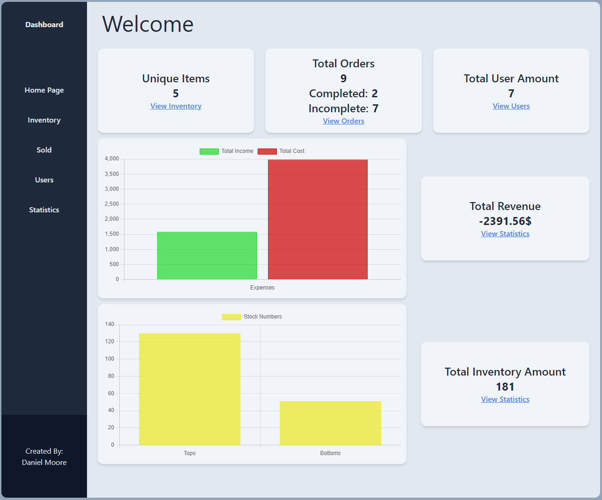

This is the home page of the content management system dashboard. This page shows a general overview of your shop and gives some import data from each of the tabs listed in the sidebar. Clicking any of the links will take you to their respective page and function the same as if you were to click them on the sidebar.

<a name="Usage - Inventory"></a>

## Usage - Inventory

**Inventory Page**
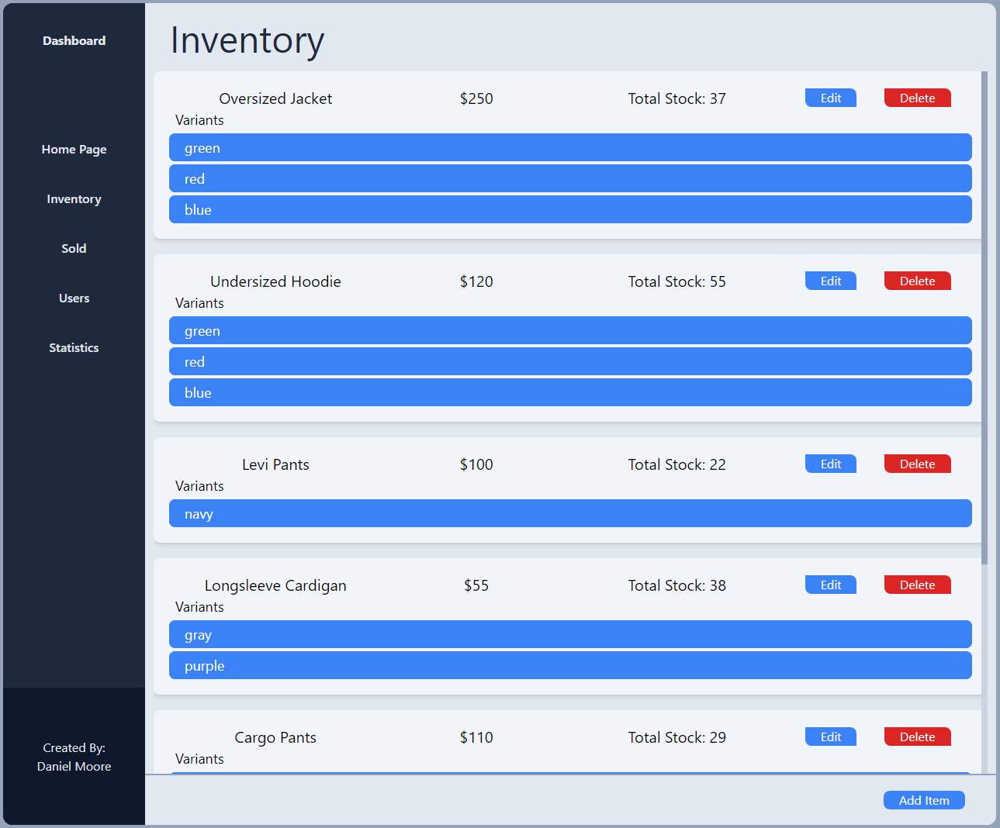

While in the inventory page tab, you will be met with your entire inventory. This includes all of the clothing_item objects you have created as well as their variants/colors. For the first clothing item listed, in order from left to right, you can see the item name, its price, and the total stock. Below that is a list of colors. Clicking on a color will open up a tab displaying all of the current stock numbers and their correlating sizes.

**Edit Inventory Modal**
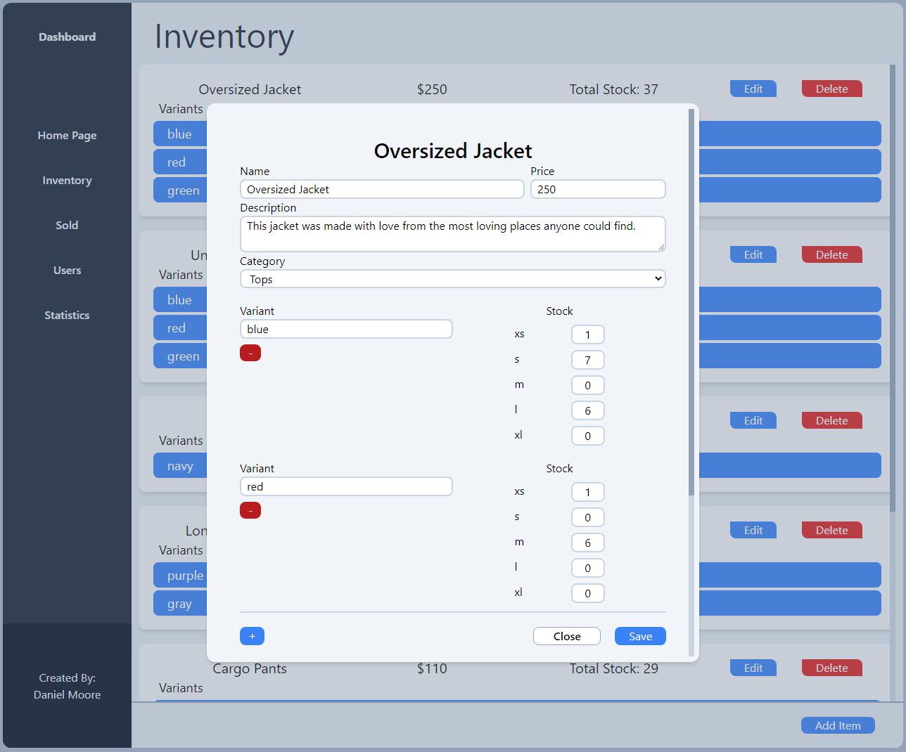

Clicking on the edit button to the far left will spawn a modal with all of the selected clothing item's data. From here you can edit all of the various attributes involved with the creation of a clothing item. This includes colors/variants as well as stock. The way I created the payload to handle this particular method of editing may be a bit far fetched but it is working and works to scale.

To add a color click the plus button in the far most bottom left corner of the modal. Clicking the close button will exit the modal without saving any currently made changes, and clicking the save button will submit the changes made.

**Delete Color Modal**


Upon clicking the red minus button found below each color you will be met with another modal asking if you would like to confirm the deletion of the color. Selecting **Delete** will remove the color and **cancel** will close the modal without any changes.

**Create Item Modal**
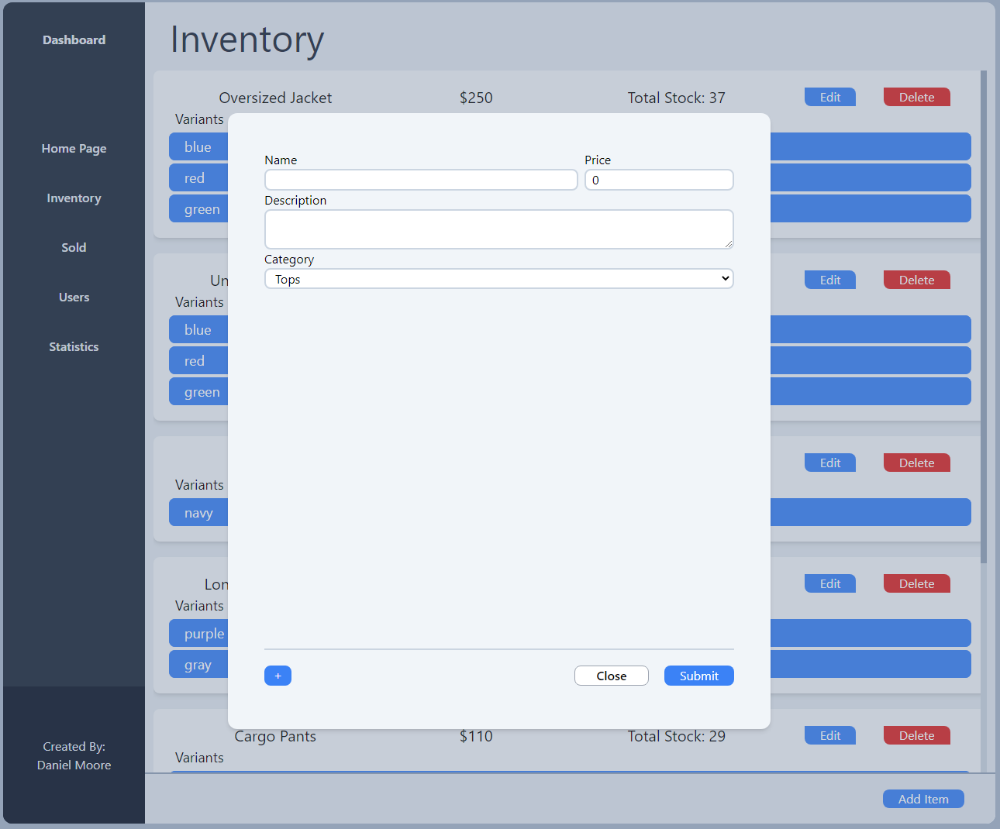

Going back to the **Inventory Page** and clicking the **Add Item** button in the bottom right corner you will be met with a modal similar to the **Edit Inventory Modal** however this one is completely empty and yours to fill out. The functionalities are the exact same between the two modals.

**Delete Item Modal**
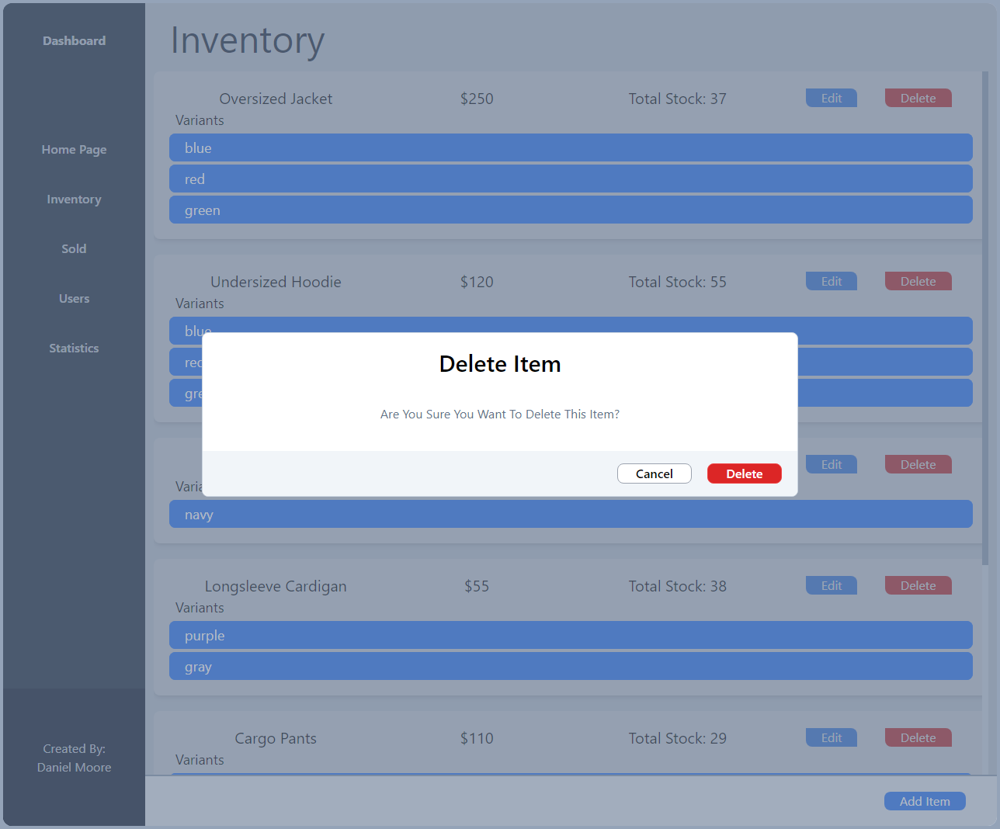

Selecting the **Delete** button to the right of the **Edit** button found to the top right of each clothing item will bring up a modal asking "Are You Sure You Want To Delete This Item?". Selecting **Delete** will remove the selected clothing item and selecting cancel will close the modal without any changes.

<a name="Usage - Sold"></a>

## Usage - Sold

**Sold Page**


Clicking on the **Sold** text in the sidebar will take you to the sold page where you will see a listing of all of your sales/orders. In order from right to left you'll see the item name, price, shipping type, date ordered, order number, fulfilled checkbox and a button to click for more details on that order.

Clicking the checkbox to either check fulfilled or uncheck will immediately edit the selected order item. If checked then **order_status** will be set to true, and if unchecked it will be set to false.

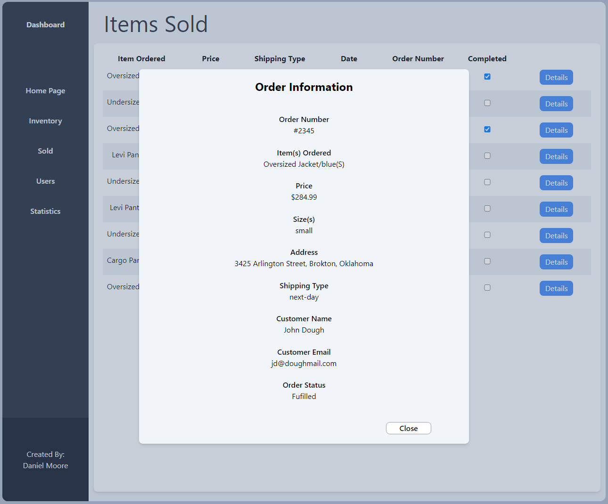

Clicking the **Details** button at the far right will open up a modal with the information corresponding to the selected order. This shows even more information and is a sort of receipt for the shop owner to view.

<a name="Usage - Users"></a>

## Usage - Users

**Users Page**


This page lists the users in your store and displays the orders per user. This page is fairly similar to the **Sold Page** in that it has about the same order information however the top of each section has the users name, email, and join date.

Clicking the details button next an order will open a modal with the same information found in the **Sold Page** order modal.

<a name="Usage - Statistics"></a>

## Usage - Statistics

**Statistics Page**


Clicking on the **Statistics** text in the sidebar will take you to the statistics page. This page displays useful numbers in relationship to sales as well as costs to take into consideration when running your business.

This page utilizes chartjs and react-chartjs-2 to create these really nice looking graphs.

At the top you'll see your income per day and below that you can see your total costs and total income. These numbers are color coded and include the shipping income, shipping costs, item income, and item costs.

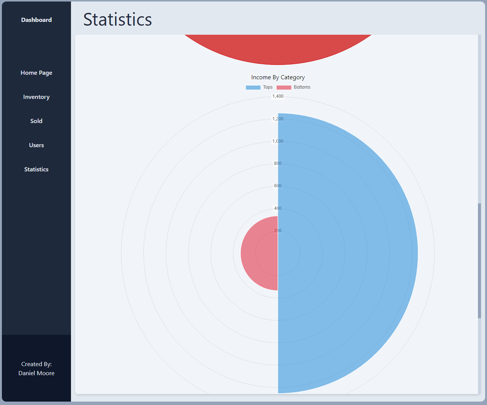

Moving to the middle of the page you'll see income by category. This is displayed in a polar area chart. You can visualize sale percentage as well as view the actual amount from just looking.

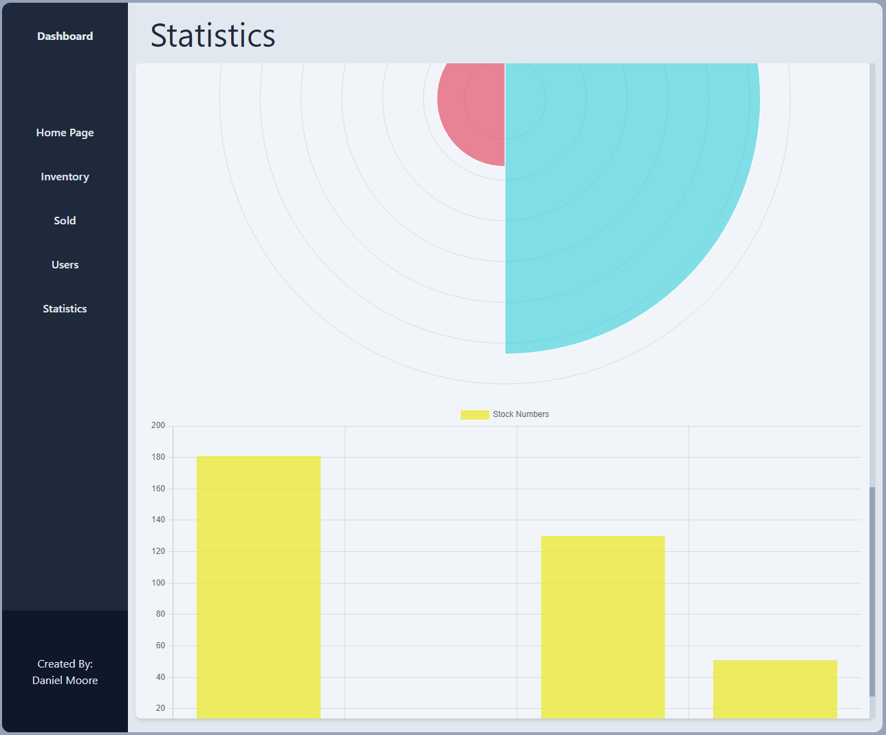

At the bottom of the page is where you will find the stock numbers of all the inventory in your store. Total stock being the culmination of everything you are selling. Unique stock is the amount of individual items you are selling, not including their colors/variants. Then you have your stock per category which is generated based on the categories you have set up.

<a name="Usage - Mobile"></a>

## Usage - Mobile

While there aren't a lot of discrepancies between the desktop and mobile versions of the application there are a slight few.

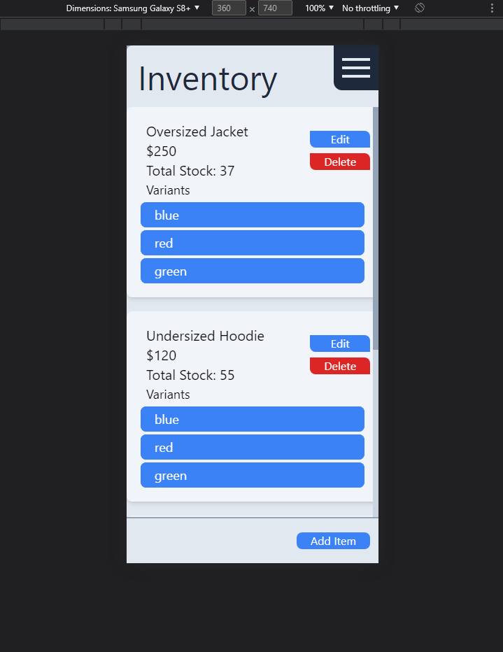
The main difference is going to be that the sidebar is now hidden and is controlled by a button in the lower left hand corner. Clicking this button will open up the sidebar and you can navigate through the pages from there.

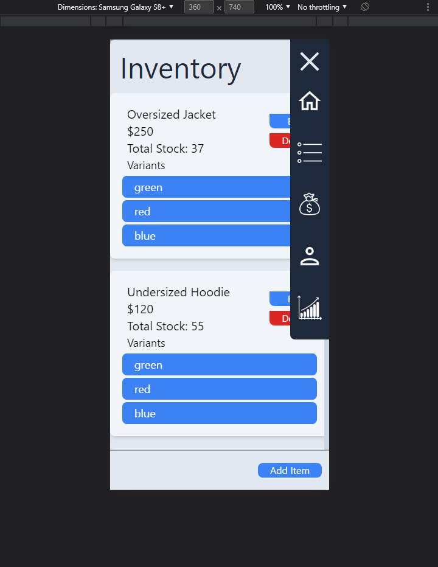

The sidebar layout is the same just instead of text there are now icons representing each page you can navigate to.

<a name="Testing"></a>

## Testing

While my tests don't have the most coverage or test any of the currently setup react portions of my project. I do have some unit tests which run checks on the helper functions to ensure that things are not going wrong when information comes from the backend into the frontend.

Tests can be found in the client folder `/client/src/utils/helpers/__test__`

While in the root folder, running `cd client && npm run test` in the terminal will run the tests I currently have setup.

<a name="Contributions"></a>

## Contributions

If you wish to add anything to this project or collaborate feel free to email me at danielchrismoore@gmail.com Also feel free to fork and clone this project. Feedback is greatly appreciated. As I am currently a junior developer any critisism is also very welcome.
